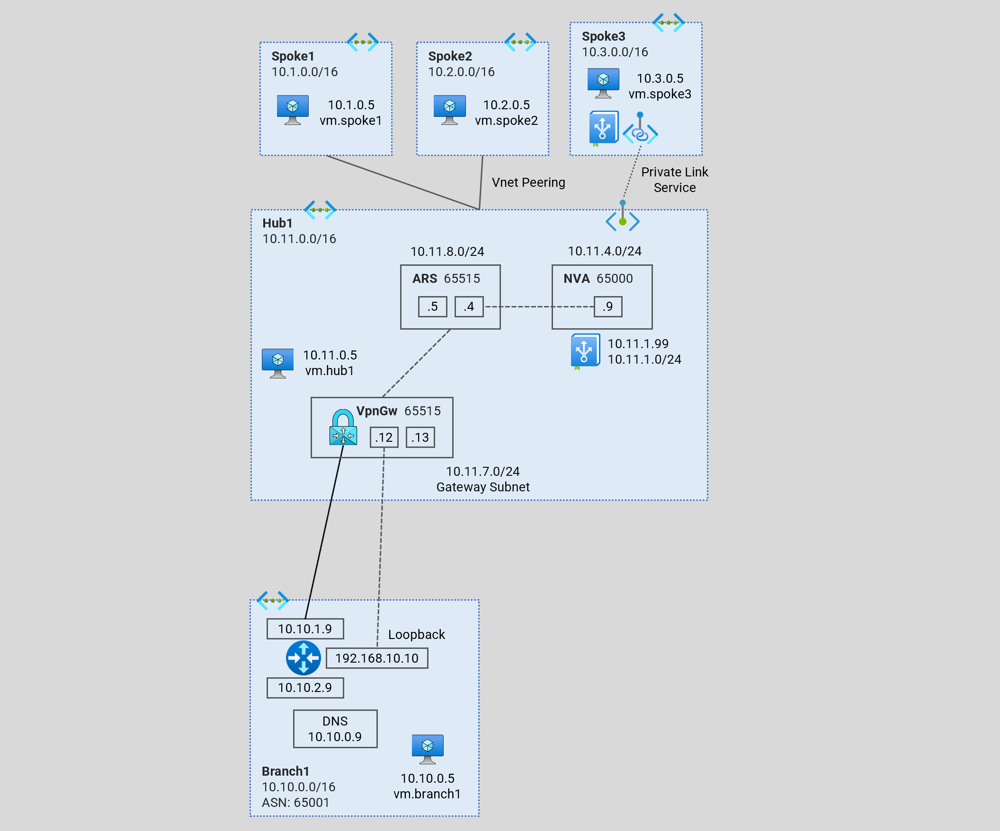

# Hub and Spoke - Single Region

## Overview

This terraform code deploys a hub and spoke topology playground to observe dynamic routing with Azure Route Server (ARS) and a Network Virtual Appiance (NVA).

`Hub1` ARS with BGP session to a Network Virtual Appliance (NVA) using a Cisco-CSR-100V router. The direct spokes `Spoke1` and `Spoke2` have VNET peering to `Hub1`. An isolated `Spoke3` does not have VNET peering to the hub, but is reachable from `Hub1` via Private Link Service.
 
`Branch1` is the on-premises network which is simulated in a VNET using a multi-NIC Cisco-CSR-100V NVA appliance. 



### Recommended additional reading

1. [Routing through Network Virtual Appliances with Azure Private Link](https://github.com/mddazure/azure-privatelink-routing) by [Marc De Droog](https://github.com/mddazure)


## Lab Prerequisites

Ensure you meet all requirements in the [prerequisites](../../prerequisites/) before proceeding.

## Clone the Lab

Open a Cloud Shell terminal and run the following command:
1. Clone the Git Repository for the Labs
```sh
git clone https://github.com/kaysalawu/azure-network-terraform.git
```

2. Change to the lab directory
```sh
cd azure-network-terraform/1-hub-and-spoke/1-hub-spoke-single-region
```

## Deploy the Lab

To deploy the lab run the following terraform commands and type **yes** at the prompt:
```sh
terraform init
terraform plan
terraform apply
```

## Troubleshooting

See the [troubleshooting](../../troubleshooting/) section for tips on how to resolve common issues that may occur during the deployment of the lab.

## Cleanup

1. Change to the lab directory
```sh
cd azure-network-terraform/1-hub-and-spoke/1-hub-spoke-single-region
```

2. Delete the resource group to remove all resources installed.\
Run the following Azure CLI command:

```sh
az group delete -g HubSpokeS1RG --no-wait
```
