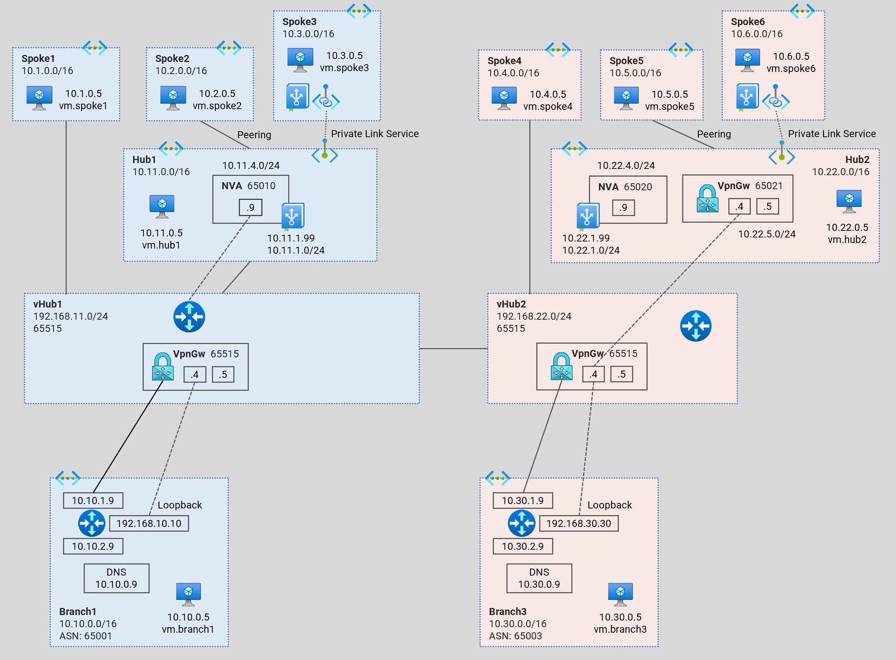

# Virtual WAN - Dual Hub (Mixed)

## Overview

This terraform code deploys a multi-hub (multi-region) virtual WAN architecture playground to observe dynamic routing patterns.

For one region, we integrate the standard hub (`hub1`) to the virtual WAN hub (`vHub1`) via a virtual WAN connection. `vHub1` has a direct spoke (`Spoke1`) connected via a virtual WAN connection. `Spoke2` is an indirect spoke from a virtual WAN perspective; and is connected via standard VNET peering to `Hub1`. 

For the second region, we integrate the standard hub (`hub2`) to the virtual WAN hub (`vHub2`) via an IPsec VPN connection. `vHub2` has a direct spoke (`Spoke4`) connected via a virtual WAN connection. `Spoke5` is an indirect spoke from a virtual WAN perspective; and is connected via standard VNET peering to `Hub2`. 

The isolated spokes (`Spoke3` and `Spoke6`) do not have VNET peering to their respective hubs (`Hub1` and `Hub2`), but are reachable via Private Link Service through a private endpoint in each hub.

`Branch1` and `Branch3`are the on-premises networks which are simulated in VNETs using multi-NIC Cisco-CSR-100V NVA appliances.



### Recommended reading

1. [Routing through Network Virtual Appliances with Azure Private Link](https://github.com/mddazure/azure-privatelink-routing) by [Marc De Droog](https://github.com/mddazure)
2. [Lab: High Available NVAs with Azure Route Server](https://github.com/dmauser/azure-routeserver/tree/main/ars-nhip#lab-high-available-nvas-with-azure-route-server)

## Lab Prerequisites

Ensure you meet all requirements in the [prerequisites](../../prerequisites/) before proceeding.

## Clone the Lab

Open a Cloud Shell terminal and run the following command:
1. Clone the Git Repository for the Labs
```sh
git clone https://github.com/kaysalawu/azure-network-terraform.git
```

2. Change to the lab directory
```sh
cd azure-network-terraform/2-virtual-wan/4-virtual-wan-dual-hub-mixed
```

## Deploy the Lab

To deploy the lab run the following terraform commands and type **yes** at the prompt:
```sh
terraform init
terraform plan
terraform apply
```

## Troubleshooting

See the [troubleshooting](../../troubleshooting/) section for tips on how to resolve common issues that may occur during the deployment of the lab.

## Cleanup

1. Change to the lab directory
```sh
cd azure-network-terraform/2-virtual-wan/4-virtual-wan-dual-hub-mixed
```

2. Delete the resource group to remove all resources installed.\
Run the following Azure CLI command:

```sh
az group delete -g VwanS4RG --no-wait
```
