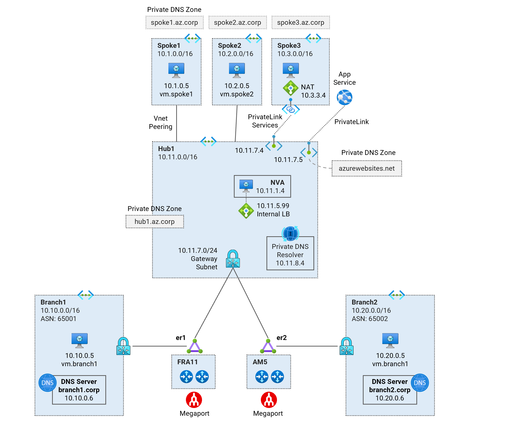

# Hub and Spoke - Single Region (NVA) <!-- omit from toc -->

## Lab: Ge41 <!-- omit from toc -->

Contents

- [Overview](#overview)
- [Prerequisites](#prerequisites)
- [Deploy the Lab](#deploy-the-lab)
- [Troubleshooting](#troubleshooting)
- [Outputs](#outputs)
- [Testing](#testing)
- [Cleanup](#cleanup)

## Overview

Deploy a single-region Hub and Spoke Vnet topology using Virtual Network Appliances (NVA) for traffic inspection. Learn about traffic routing patterns, [hybrid DNS](https://learn.microsoft.com/en-us/azure/dns/private-resolver-hybrid-dns) resolution, NVA deployment, and [PrivateLink Services](https://learn.microsoft.com/en-us/azure/private-link/private-link-service-overview) access to IaaS, [PrivateLink](https://learn.microsoft.com/en-us/azure/private-link/private-link-overview) access to PaaS services.



***Hub1*** is a Vnet hub that has an NVA used for inspection of traffic between an on-premises branch and Vnet spokes. User-Defined Routes (UDR) are used to influence the hub Vnet data plane to route traffic between the branch and spokes via the NVA. An isolated spoke ***spoke3*** does not have Vnet peering to ***hub1***, but is reachable from the hub via [Private Link Service](https://learn.microsoft.com/en-us/azure/private-link/private-link-service-overview).

There are two on-premises locations - ***Branch1*** and ***Branch2*** that are connected via ExpressRoute using Megaport as the ExpressRoute partner. This allows us to observe dynamic routing with ExpressRoute deployed in two Microsoft peering locations.

***Branch1*** is an on-premises network simulated in a Vnet. An ExpressRoute virtual network gateway connects the branch to an ExpressRoute circuit in the Microsoft peering location ***FRA11***. Similarly, ***Branch2*** is the second on-premises network simulated in a Vnet. An ExpressRoute virtual network gateway connects the branch to an ExpressRoute circuit in the Microsoft peering location ***AM5***.

## Prerequisites

Ensure you meet all requirements in the [prerequisites](../../prerequisites/) before proceeding.

## Deploy the Lab

1. Clone the Git Repository for the Labs

   ```sh
   git clone https://github.com/kaysalawu/azure-network-terraform.git
   ```

2. Navigate to the lab directory

   ```sh
   cd azure-network-terraform/4-general/1-er-two-edge-locations
   ```

3. Run the following terraform commands and type ***yes*** at the prompt:

   ```sh
   terraform init
   terraform plan
   terraform apply -parallelism=50
   ```

## Troubleshooting

See the [troubleshooting](../../troubleshooting/) section for tips on how to resolve common issues that may occur during the deployment of the lab.

## Outputs

The table below show the auto-generated output files from the lab. They are located in the `output` directory.

| Item    | Description  | Location |
|--------|--------|--------|
| IP ranges and DNS | IP ranges and DNS hostname values | [output/values.md](./output/values.md) |
| Branch DNS Server | Unbound DNS server configuration showing on-premises authoritative zones and conditional forwarding to hub private DNS resolver endpoint | [output/branch-unbound.sh](./output/branch-unbound.sh) |
| Branch1 NVA | Cisco IOS commands for IPsec VPN, BGP, route maps etc. | [output/branch1-nva.sh](./output/branch1-nva.sh) |
| Hub1 NVA | Linux NVA configuration. | [output/hub1-linux-nva.sh](./output/hub1-linux-nva.sh) |
| Web server for workload VMs | Python Flask web server and various test and debug scripts | [output/server.sh](./output/server.sh) |
||||

## Testing

(In progress)

## Cleanup

1. (Optional) Navigate back to the lab directory (if you are not already there)

   ```sh
   cd azure-network-terraform/4-general/1-er-two-edge-locations
   ```

2. Delete the resource group to remove all resources installed.

   ```sh
   az group delete -g Ge41RG --no-wait
   ```
