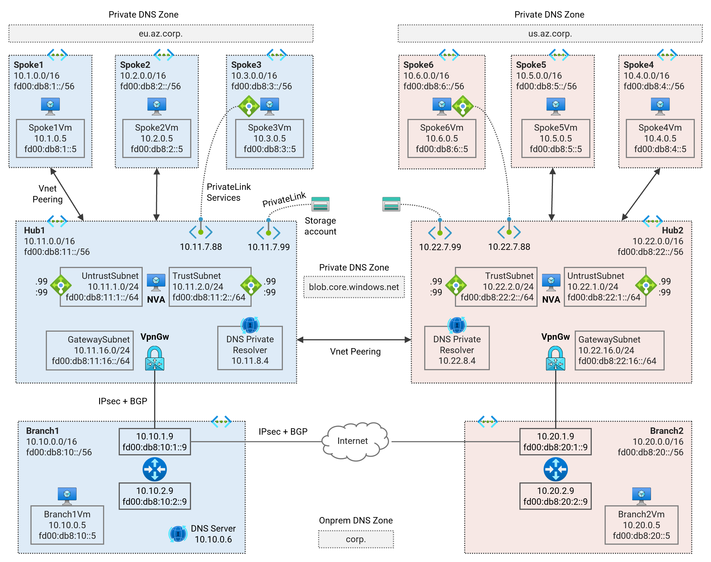
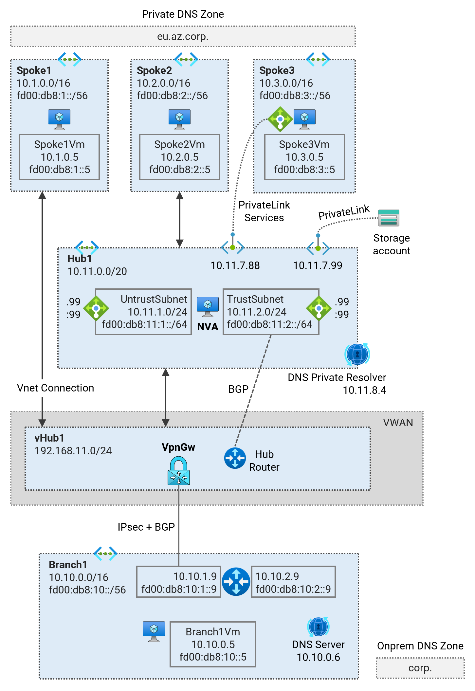
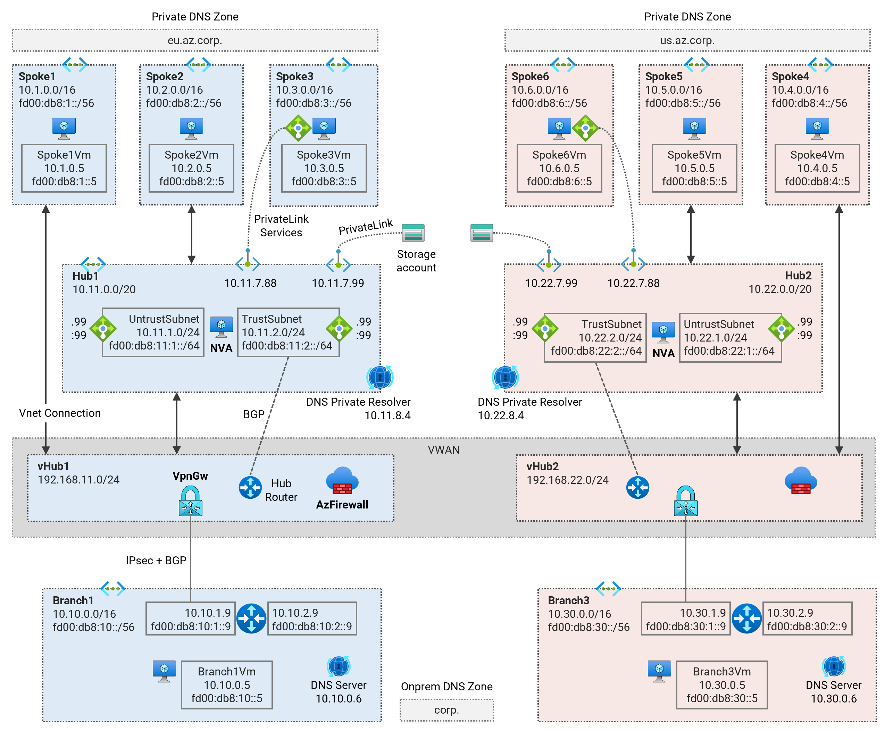

# Azure Network Architecture - Terraform Examples <!-- omit from toc -->

## [1. Hub and Spoke](./1-hub-and-spoke)

The terraform codes in this collection cover different hub and spoke network patterns using standard VNET solutions.

### 1.1. Secure Hub and Spoke - Single Region
[Terraform Code](./1-hub-and-spoke/1-hub-spoke-azfw-single-region/)

This terraform code deploys a single-region Secured Virtual Network (Vnet) hub and spoke topology using Azure firewall and User-Defined Routes (UDR) to direct traffic to the firewall.

### 1.2. Secure Hub and Spoke - Dual Region
[Terraform Code](./1-hub-and-spoke/2-hub-spoke-azfw-dual-region/)

This terraform code deploys a multi-region Secured Virtual Network (Vnet) hub and spoke topology using Azure firewall and User-Defined Routes (UDR) to direct traffic to the firewall.

### 1.3. Hub and Spoke Secure using NVA - Single Region
[Terraform Code](./1-hub-and-spoke/3-hub-spoke-nva-single-region/)

This terraform code deploys a single-region standard Virtual Network (Vnet) hub and spoke topology using Virtual Network Appliances (NVA) in the hub.

### 1.4. Hub and Spoke Secure using NVA - Dual Region
[Terraform Code](./1-hub-and-spoke/4-hub-spoke-nva-dual-region/)

This terraform code deploys a multi-region Virtual Network (Vnet) hub and spoke topology with dynamic routing using Network Virtual Aplliance (NVA) and Azure Route Server (ARS).

## [2. Virtual WAN](./2-virtual-wan/)

The terraform codes in this collection cover different hub and spoke network patterns using Virtual WAN.

### 2.1. Virtual WAN - Single Region
[Terraform Code](./2-virtual-wan/1-vwan-single-region/)

This terraform code deploys a single-region Virtual WAN (Vwan) testbed to observe traffic routing patterns.

### 2.2. Virtual WAN - Dual Region
[Terraform Code](./2-virtual-wan/2-vwan-dual-region/)

This terraform code deploys a multi-hub (multi-region) Virtual WAN (Vwan) testbed to observe traffic routing patterns.

### 2.3. Secured Virtual WAN - Single Region
[Terraform Code](./2-virtual-wan/3-vwan-sec-single-region/)

This terraform code deploys a single-region Secured Virtual WAN (Vwan) testbed to observe traffic routing patterns. *Routing Intent* feature is enabled to allow traffic inspection on Azure firewalls for traffic between spokes and branches.

### 2.4. Secured Virtual WAN - Dual Region
[Terraform Code](./2-virtual-wan/4-vwan-sec-dual-region/)

This terraform code deploys a multi-hub (multi-region) Secured Virtual WAN (Vwan) testbed to observe traffic routing patterns. *Routing Intent* feature is enabled to allow traffic inspection on Azure firewalls for traffic between spokes and branches.

## [3. Virtual Network Manager](./3-virtual-network-manager/)

## [4. POC](./4-poc/)
### 4.1 [Secured Virtual WAN (Dual Region) with Routing Intent and Secure Web Gateway](./4-poc/1-vwan-sec-dual-region-ri-swg/)
